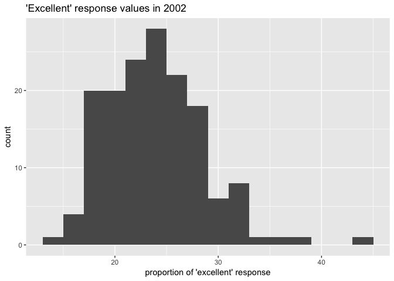
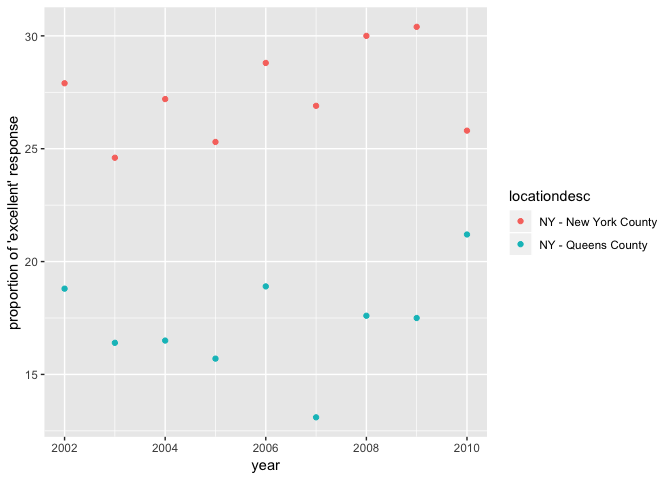

p8105\_hw2\_tt2714
================
Tiffany Tu
9/30/2018

## Problem 1

#### Data import and cleaning

This dataset contains information on New York City transit lines,
station names, station latitude and longitude, routes served, type of
entry, available entry, available vending machine, and ADA compliance.
My data cleaning steps include cleaning all column names with janitor,
selecting only wanted columns of the dataset, and converting the entry
column from yes/no to logical variables.

The dimension of the dataset is 1868 x 19. It is not tidy because there
is too much overlapping information in the columns. It is unclear how
many distinct transit lines, stations, or routes there are in the
system, making it difficult to analyze and to find relevant information.
The station latitude/longitude columns also give repetitive
data.

``` r
nyc_transit = read_csv(file = "./data/NYC_Transit_Subway_Entrance_And_Exit_Data.csv") %>% 
  janitor::clean_names() %>% 
  select(-division, -exit_only, -staffing, -staff_hours, -ada_notes, -free_crossover:-entrance_location) %>% 
  replace(., is.na(.), "") %>% 
  unite(route, route1:route11, sep = " ") %>% 
  mutate(entry = ifelse(entry == "YES", TRUE, FALSE)) %>% 
  mutate(vending = ifelse(vending == "YES", TRUE, FALSE)) 

head(nyc_transit)
```

    ## # A tibble: 6 x 9
    ##   line  station_name station_latitude station_longitu… route entrance_type
    ##   <chr> <chr>                   <dbl>            <dbl> <chr> <chr>        
    ## 1 4 Av… 25th St                  40.7            -74.0 "R  … Stair        
    ## 2 4 Av… 25th St                  40.7            -74.0 "R  … Stair        
    ## 3 4 Av… 36th St                  40.7            -74.0 "N R… Stair        
    ## 4 4 Av… 36th St                  40.7            -74.0 "N R… Stair        
    ## 5 4 Av… 36th St                  40.7            -74.0 "N R… Stair        
    ## 6 4 Av… 45th St                  40.6            -74.0 "R  … Stair        
    ## # ... with 3 more variables: entry <lgl>, vending <lgl>, ada <lgl>

#### Dataset overview:

``` r
station_nyc_transit = distinct(nyc_transit, station_name, route, .keep_all = TRUE)
Atrain_stations = station_nyc_transit[grep("A", station_nyc_transit$route), ]
```

There are 456 distinct stations. 79 of the stations are ADA compliant.
The proportion of station entrances/exits without a vending that allows
entrance is 0.0199115.  
There are 58 stations that serve the A train, of these stations 17 are
ADA
compliant.

## Problem 2

#### Mr. Trash Wheel dataset (2018-7)

``` r
trashwheel = read_excel("./data/HealthyHarborWaterWheelTotals2018-7-28.xlsx", sheet = 1, range = cell_cols(1:14)) %>% 
  janitor::clean_names() %>% 
  filter(str_detect(month, "Total") == FALSE) %>% 
  mutate_at(13, as.integer, 0)

head(trashwheel)
```

    ## # A tibble: 6 x 14
    ##   dumpster month  year date                weight_tons volume_cubic_ya…
    ##      <dbl> <chr> <dbl> <dttm>                    <dbl>            <dbl>
    ## 1        1 May    2014 2014-05-16 00:00:00        4.31               18
    ## 2        2 May    2014 2014-05-16 00:00:00        2.74               13
    ## 3        3 May    2014 2014-05-16 00:00:00        3.45               15
    ## 4        4 May    2014 2014-05-17 00:00:00        3.1                15
    ## 5        5 May    2014 2014-05-17 00:00:00        4.06               18
    ## 6        6 May    2014 2014-05-20 00:00:00        2.71               13
    ## # ... with 8 more variables: plastic_bottles <dbl>, polystyrene <dbl>,
    ## #   cigarette_butts <dbl>, glass_bottles <dbl>, grocery_bags <dbl>,
    ## #   chip_bags <dbl>, sports_balls <int>, homes_powered <dbl>

#### 2016 and 2017 precipitation data…

``` r
trashwheel_2017 = read_excel("./data/HealthyHarborWaterWheelTotals2018-7-28.xlsx", sheet = "2017 Precipitation", skip = 1) %>%
  janitor::clean_names() %>% 
  drop_na() %>% 
  add_column(., year = 2017) %>% 
  select(1, 3, total.precipitation = 2) 

head(trashwheel_2017)
```

    ## # A tibble: 6 x 3
    ##   month  year total.precipitation
    ##   <dbl> <dbl>               <dbl>
    ## 1     1  2017                2.34
    ## 2     2  2017                1.46
    ## 3     3  2017                3.57
    ## 4     4  2017                3.99
    ## 5     5  2017                5.64
    ## 6     6  2017                1.4

``` r
trashwheel_2016 = read_excel("./data/HealthyHarborWaterWheelTotals2018-7-28.xlsx", sheet = "2016 Precipitation", skip = 1) %>% 
  janitor::clean_names() %>%
  drop_na() %>% 
  add_column(., year = 2016) %>% 
  select(1, 3, total.precipitation = 2)

head(trashwheel_2016)
```

    ## # A tibble: 6 x 3
    ##   month  year total.precipitation
    ##   <dbl> <dbl>               <dbl>
    ## 1     1  2016                3.23
    ## 2     2  2016                5.32
    ## 3     3  2016                2.24
    ## 4     4  2016                1.78
    ## 5     5  2016                5.19
    ## 6     6  2016                3.2

``` r
#combine 2016 and 2017 datasets
trashwheel_1617 = rbind(trashwheel_2016, trashwheel_2017) %>% 
  mutate(month.name[month], month = NULL) %>% 
  select(month = 3, 1, 2)

trashwheel_1617
```

    ## # A tibble: 24 x 3
    ##    month      year total.precipitation
    ##    <chr>     <dbl>               <dbl>
    ##  1 January    2016                3.23
    ##  2 February   2016                5.32
    ##  3 March      2016                2.24
    ##  4 April      2016                1.78
    ##  5 May        2016                5.19
    ##  6 June       2016                3.2 
    ##  7 July       2016                6.09
    ##  8 August     2016                3.96
    ##  9 September  2016                4.53
    ## 10 October    2016                0.62
    ## # ... with 14 more rows

#### Dataset overview

The Mr. Trash Wheel dataset provides a total of 285 dumpster
observations from 2014 through 2018. For 2017, we are able to see 55
observations for the whole year. For 2016, we have 51 observations.
There is an average of 12709.0909091 cigarette butts observed in 2017 as
compared to an average of 37639.2156863 observed in 2016, which is a
huge improvement. In 2018, the number of cigarette butts continued to
decrease. So far we are seeing 2505.9659091 less cigarette butts from
2017. For the past five years, a median of 3.33 tons of weight and a
median of 15 cubic yards in dumpsters were observed.

Total precipitation for 2017 is 32.93. The median number of sports balls
in a dumpster in 2016 is 26.

Here we have a quick table that provides the number of observations per
year for reference.

<table>

<tbody>

<tr>

<td style="text-align:left;">

year

</td>

<td style="text-align:right;">

2014

</td>

<td style="text-align:right;">

2015

</td>

<td style="text-align:right;">

2016

</td>

<td style="text-align:right;">

2017

</td>

<td style="text-align:right;">

2018

</td>

</tr>

<tr>

<td style="text-align:left;">

n

</td>

<td style="text-align:right;">

44

</td>

<td style="text-align:right;">

71

</td>

<td style="text-align:right;">

51

</td>

<td style="text-align:right;">

55

</td>

<td style="text-align:right;">

64

</td>

</tr>

</tbody>

</table>

## Problem 3

Dataset from Behavioral Risk Factors Surveillance System for Selected
Metropolitan Area Risk Trends is uploaded and cleaned for analysis on
“Overall Health” topic.

``` r
overallhealth_brfss_smart2010 = brfss_smart2010 %>% 
  janitor::clean_names() %>%
  subset(., topic == "Overall Health") %>% 
  select(., -class, -topic, -question, -sample_size, -(confidence_limit_low:geo_location)) %>%
  spread(response, data_value) %>%
  janitor::clean_names() %>% 
  mutate(., excellent_or_verygood = rowSums(cbind(excellent, very_good)))

head(overallhealth_brfss_smart2010)
```

    ## # A tibble: 6 x 9
    ##    year locationabbr locationdesc excellent  fair  good  poor very_good
    ##   <int> <chr>        <chr>            <dbl> <dbl> <dbl> <dbl>     <dbl>
    ## 1  2002 AK           AK - Anchor…      27.9   8.6  23.8   5.9      33.7
    ## 2  2002 AL           AL - Jeffer…      18.5  12.1  32.7   5.9      30.9
    ## 3  2002 AR           AR - Pulask…      24.1  12.5  29.9   4.2      29.3
    ## 4  2002 AZ           AZ - Marico…      21.6  10.3  26.9   4.6      36.6
    ## 5  2002 AZ           AZ - Pima C…      26.6   7.5  31.9   3.9      30.1
    ## 6  2002 CA           CA - Los An…      22.7  14.3  28.7   4.5      29.8
    ## # ... with 1 more variable: excellent_or_verygood <dbl>

There are 51 unique locations in this dataset. Every state is included
in this dataset, including District of Columbia. The most frequent
occurence is WY out of all the states represented.

In 2002, the median numeber of “Excellent” response value is
23.6.

#### “Excellent” responses in 2002

``` r
ggplot(subset(overallhealth_brfss_smart2010, year == 2002), aes(x = excellent)) + 
  geom_histogram(binwidth = 2) + labs(title = "'Excellent' response values in 2002", x = "proportion of 'excellent' response")
```

    ## Warning: Removed 2 rows containing non-finite values (stat_bin).

<!-- -->

#### “Excellent” responses in New York County and Queens County

``` r
nycounty = overallhealth_brfss_smart2010 %>% 
  filter(locationdesc == "NY - New York County" | locationdesc == "NY - Queens County")

ggplot(nycounty, aes(x = year, y = excellent)) + geom_point(aes(color = locationdesc)) + 
  labs(x = "year", y = "proportion of 'excellent' response")
```

<!-- -->
